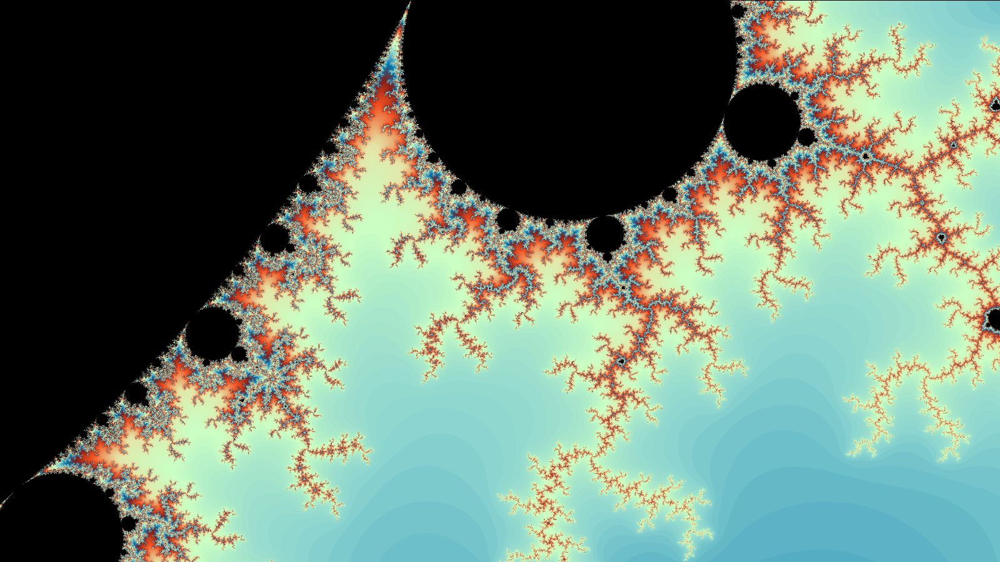
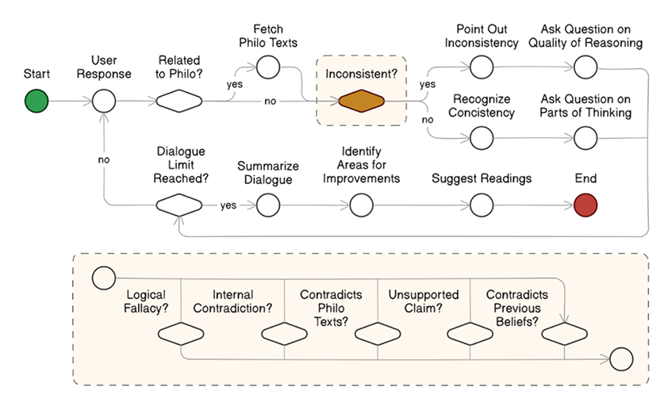
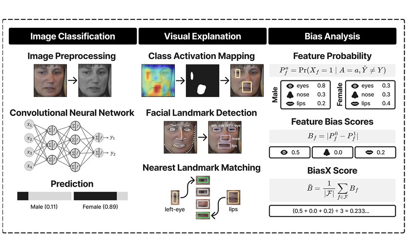
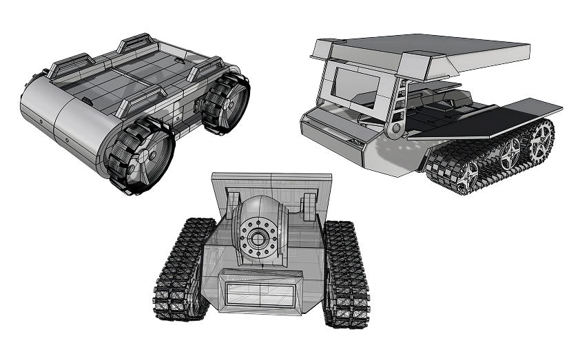

I'm an academic working in **natural language processing**, **computer vision**, and **robotics**. My research centers on building trustworthy AI systems by revealing how they work internally.

### 🔭 Focus

Right now, I'm exploring interpretability for embodied intelligence. I ask questions like: How do physical agents perceive and interact with their environment? What mechanisms drive their decision making?

### 💻 Competencies

I have extensive experience with frameworks such as:

  
  
  
  
  
  
  
  
  
  
  
  
  
  
  
  
  
  
  
  
  
  
  
  
  

### 🔬 Research

Some of my key projects include:

<table style="width:100%; table-layout:fixed; border-collapse:collapse;">
  <colgroup>
    <col style="width:33.3333%" />
    <col style="width:33.3333%" />
    <col style="width:33.3333%" />
  </colgroup>
  <thead>
    <tr>
      <th style="text-align:left; padding:8px;">Eidos</th>
      <th style="text-align:left; padding:8px;">BiasX</th>
      <th style="text-align:left; padding:8px;">Teleman</th>
    </tr>
  </thead>
  <tbody>
    <tr>
      <td style="padding:8px; text-align:center;">
        
      </td>
      <td style="padding:8px; text-align:center;">
        
      </td>
      <td style="padding:8px; text-align:center;">
        
      </td>
    </tr>
    <tr>
      <td style="padding:8px; vertical-align:top;">
        A conversational agent that leverages transformer-based models to analyze inconsistencies within the belief system of philosophy students.
      </td>
      <td style="padding:8px; vertical-align:top;">
        A statistical framework that applies explainable AI techniques to detect and quantify gender biases in face recognition systems.
      </td>
      <td style="padding:8px; vertical-align:top;">
        A mobile robotics platform that uses Arduino microcontroller and LoRaWAN protocol to deliver food supplies during disaster scenarios.
      </td>
    </tr>
  </tbody>
</table>

### 🧑‍🏫 Academe

My goal is to equip students with skills essential for a successful career in computing. I am open to inquiries about my research and welcome opportunities to collaborate on new projects.
